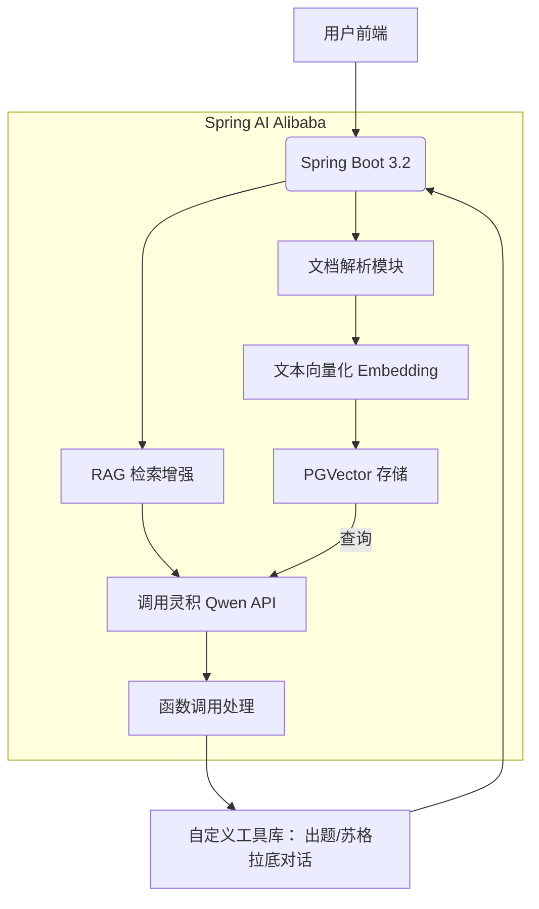

### 🧩 技术选型清单

| 组件 | 具体方案 |
| --- | --- |
| **大模型** | 阿里云灵积平台 ➜ **通义千问 Qwen-max** (支持 Function Calling) |
| **向量数据库** | **PGVector** (PostgreSQL 扩展) + **Spring Data JPA** 集成 |
| **AI 框架** | **Spring AI Alibaba** (阿里官方 Spring 生态适配) |
| **文档解析** | Spring AI 内置 `TikaDocumentReader` (解析 PPT/PDF) |
| **函数调用** | Spring AI `@Function` 注解 + 自定义工具类 |
| **部署** | 本地 Docker Compose (开发) + 阿里云 ECS + RDS (生产) |

---

### ⚙️ 系统架构图

---
