# 📚 智能课程学习伙伴

## 一、总览

### 🤲 项目定位

- **创新点**： 将课程 PPT、教材 PDF、课堂笔记构建个人专属知识库，AI 理解上下文后精准解答疑难。

- **趣味性**： 可训练 AI 用“苏格拉底式提问”引导你思考，或生成章节趣味测验题。

- **扩展性**： 加入学习进度追踪、生成思维导图

### 🧩 技术选型清单

| 组件           | 具体方案                                                       |
| -------------- | -------------------------------------------------------------- |
| **大模型**     | 阿里云灵积平台 ➜ **通义千问 Qwen-max** (支持 Function Calling) |
| **向量数据库** | **PGVector** (PostgreSQL 扩展) + **Spring Data JPA** 集成      |
| **AI 框架**    | **Spring AI Alibaba** (阿里官方 Spring 生态适配)               |
| **文档解析**   | Spring AI 内置 `TikaDocumentReader` (解析 PPT/PDF)             |
| **函数调用**   | Spring AI `@Function` 注解 + 自定义工具类                      |
| **部署**       | 本地 Docker Compose (开发) + 阿里云 ECS + RDS (生产)           |

---

### ⚙️ 系统架构图

```mermaid
graph TB
  A[用户前端] --> B(Spring Boot 3.2)
  subgraph Spring AI Alibaba
    B --> C[文档解析模块]
    C --> D[文本向量化 Embedding]
    D --> E[PGVector 存储]
    B --> F[RAG 检索增强]
    F --> G[调用灵积 Qwen API]
    G --> H[函数调用处理]
  end
  E -->|查询| G
  H --> I[自定义工具库： 出题/苏格拉底对话]
  I --> B
```

---
